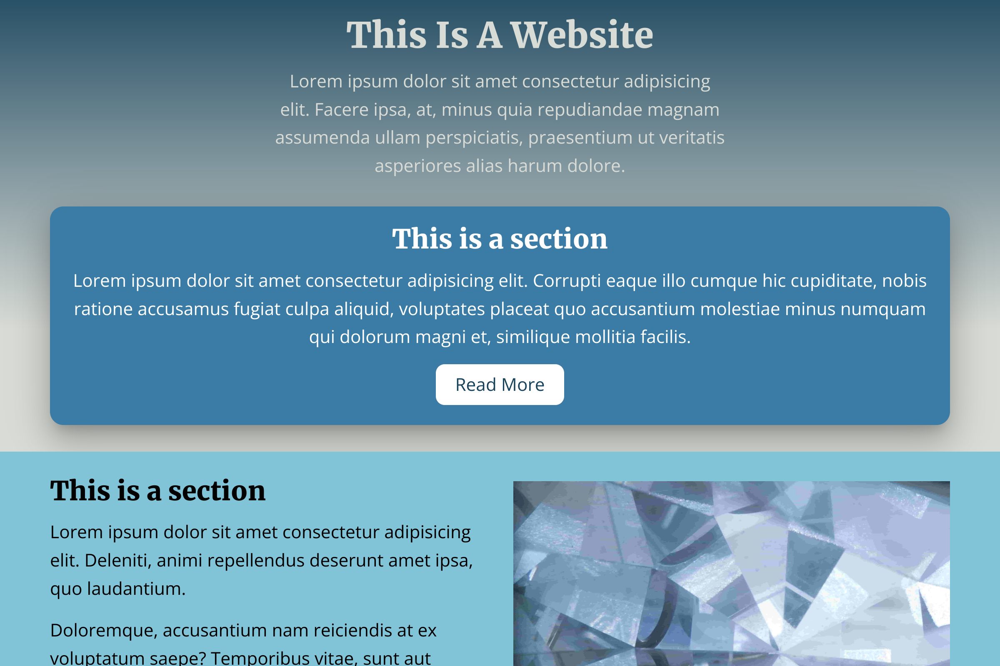

# Crystal Website

A responsive website using CSS flexbox. Color palette inspiration from [Coolors](https://coolors.co), and pictures from [Unsplash](https://unsplash.com). The website is deployed to [Netlify](https://netlify.com) and can be found [here](https://zealous-heyrovsky-6a41f6.netlify.app/).



# Requirements

[Git](https://git-scm.com) (not really required, but will make things easier).

# How to use (locally)

```bash
$ git clone https://github.com/nwnordahl/crystal-website
# or visit the url above, and download the files manually
```

Then open `index.html` with your favorite web browser, or host a local server with for example [Live Server](https://ritwickdey.github.io/vscode-live-server/) extension for [VSCode](https://code.visualstudio.com/).
